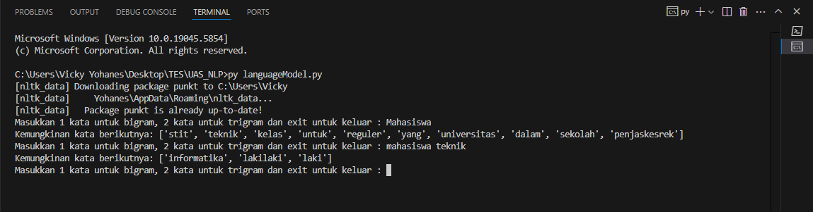
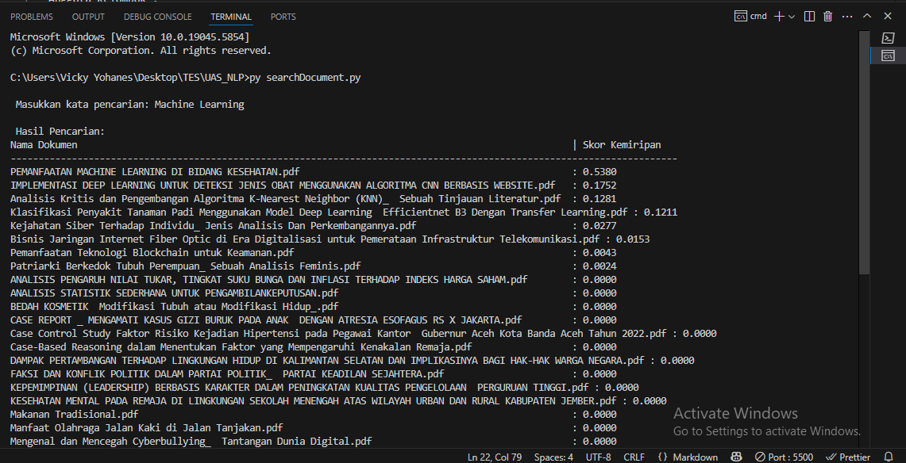
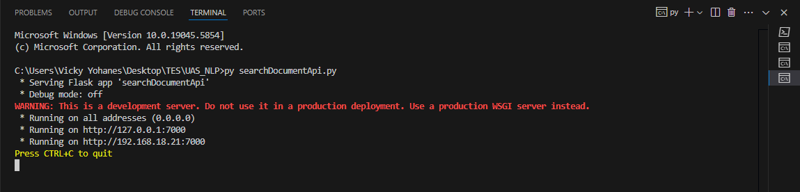
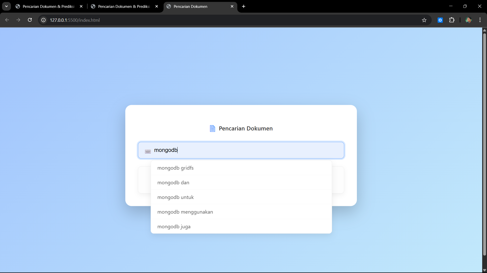
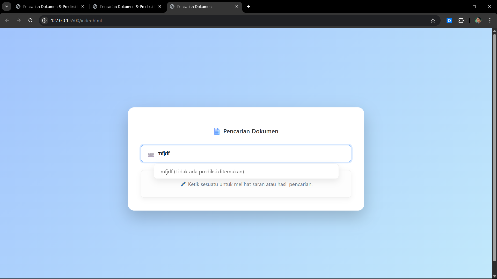
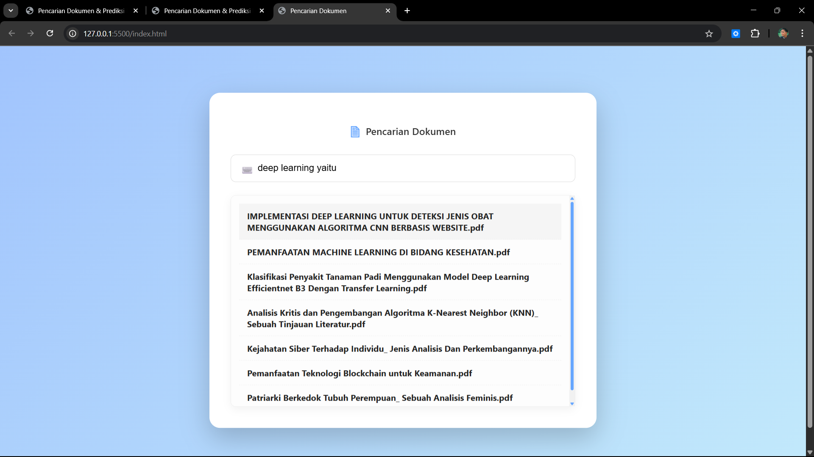

Tugas Akhir UAS Tipe B ( Language Model dan digabung dengan Search Engine tugas sebelumnya).

Anggota Kelompok : 
	71220826	Hermanus Rangga Horo
    71220863	Diva Filemon Manik
    71220925	Anjelita Haninuna
    71220956	Vicky Yohanes Putra Setiawan

Cara menjalankan Program :
1. Ekstrak File ZIP 
2. Install libary yang diperlukan => cek file requirements.txt

Menjalankan Progam Language Model di Terminal
1. Untuk menjalankan program Language Model di terminal bisa melakukan run untuk file languageModel.py
   Setelah dijalankan akan muncul perintah melakukan input seperti gambar dibawah
   py languageModel.py ( cara run )
   

Menajalan Program Search Document di Terminal
1. Untuk menjalankan program Language Model di terminal bisa melakukan run untuk file searchDocument.py
   Setelah dijalankan akan muncul perintah untuk melakukan input seperti gambar dibawah
   py searchDocument.py ( cara run )
   

Lalu untuk menjalankan program agar bisa dibuka di website dengan html maka yang harus dilakukan adalah
menyalakan 2 API dari language model dan search document.

Menjalan API language model:
1. Jalankan API language Model dengan melakukan run ke file languageModelApi.py
   Seperti gambar dibawah ini => py languageModelApi.py ( cara run )
   
Menjalankan API search dokumen:
1. Jalankan API search dokumen dengan melakukan run ke file searchDocumentApi.py
   Seperti gambar dibawah ini => py searchDocumentApi.py ( cara run )
   

Setelah 2 API tersebut dinyalakan buka file index.html di browser lalu langsung saja mengetikkan query yang diinginkan
untuk daftar query bisa melihat file unigram.csv, bigram.csv dan trigram.csv.

jika ingin melihat hasilnya di web harus masuk foldernya menggunakan vs code dan membuka file html dengan klik kanan lalu open with browser atau live server

hasil nya

